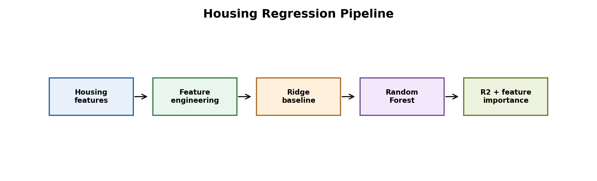
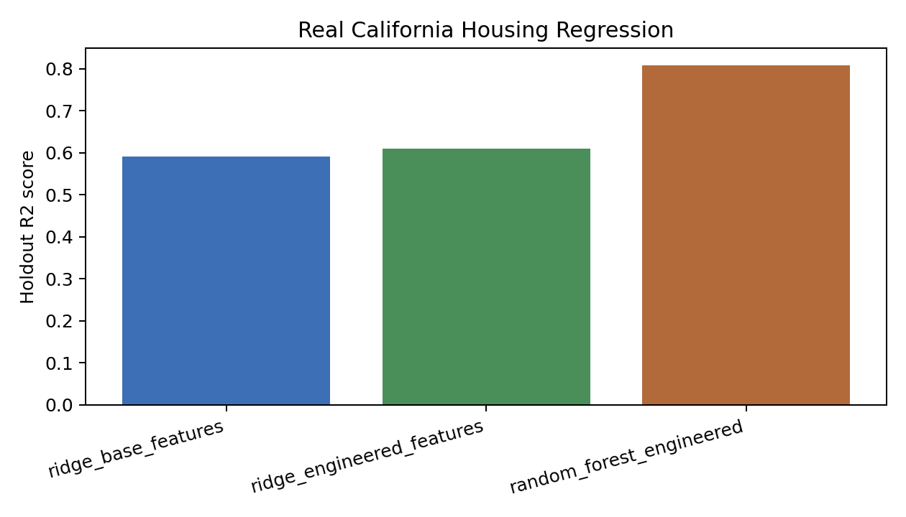
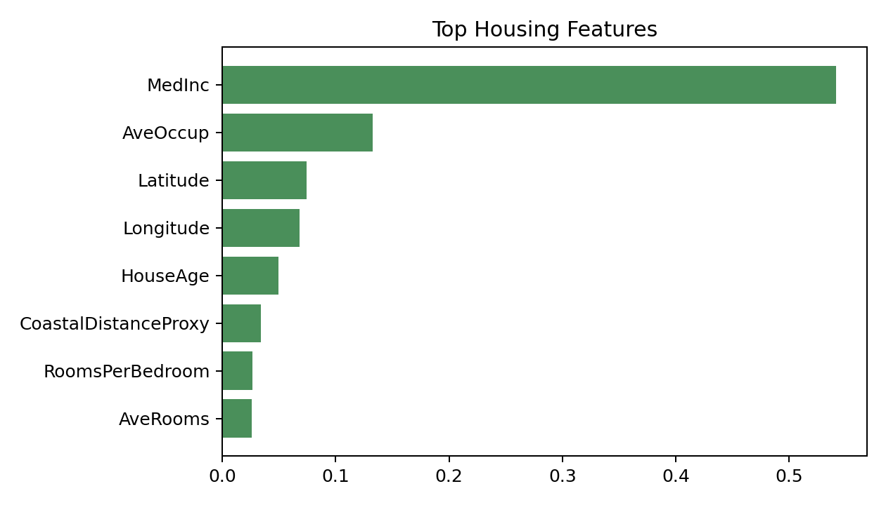

# California Housing Regression and Feature Engineering



Figure: real California Housing features are engineered, modeled, and evaluated with holdout and cross-validation metrics.

## Motivation

Regression projects should use real data when possible. The previous version used synthetic California-style data, which made the target too easy to recover. This version uses the real California Housing dataset from scikit-learn.

## Project Goal

We compared baseline linear regression, engineered-feature linear regression, and a random forest regressor on the real California Housing dataset.

## Dataset

We used `fetch_california_housing` from scikit-learn. The task is to predict median house value from district-level features such as median income, average rooms, average bedrooms, population, occupancy, latitude, and longitude.

## Tools

Python, pandas, NumPy, scikit-learn, and matplotlib.

## Methods

We evaluated:

- Ridge regression on original features
- Ridge regression with engineered features
- Random forest regression with engineered features

Engineered features:

- Rooms per bedroom
- Population per room
- Coastal distance proxy

## Hyperparameters

| Model | Main Settings |
|---|---|
| Ridge | `alpha=1.0`, standardized features |
| Random forest | 250 trees, max depth 14, min leaf size 2 |
| Holdout split | 25% test |
| Cross-validation | 5-fold shuffled KFold |

## Holdout Results

| Model | MAE | RMSE | R2 |
|---|---:|---:|---:|
| Ridge base features | 0.5297 | 0.7356 | 0.5911 |
| Ridge engineered features | 0.5231 | 0.7182 | 0.6101 |
| Random forest engineered | 0.3300 | 0.5038 | 0.8082 |

## Cross-Validation Results

| Model | CV MAE Mean | CV R2 Mean | CV R2 Std |
|---|---:|---:|---:|
| Ridge base features | 0.5317 | 0.6014 | 0.0170 |
| Ridge engineered features | 0.5238 | 0.6134 | 0.0120 |
| Random forest engineered | 0.3406 | 0.8025 | 0.0084 |





## Interpretation

Feature engineering slightly improves Ridge regression, but the gain is modest. The random forest is much stronger because it can model nonlinear relationships between income, geography, occupancy, and house value.

The cross-validation results are close to the holdout results, which means the random forest improvement is not only one lucky train/test split.

## Conclusion

This project now uses real California Housing data and gives a more credible regression comparison. The strongest model is the engineered random forest, while engineered linear features provide only a small improvement.

## How To Run

```bash
pip install -r requirements.txt
python 1_housing_regression.py
```
